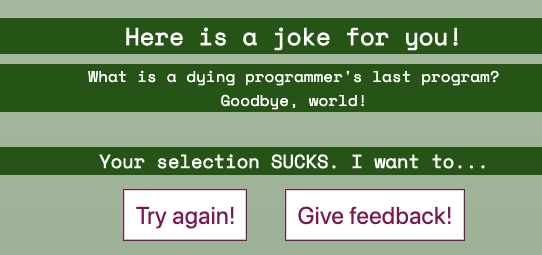
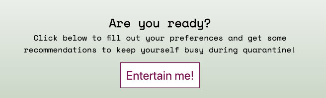

THE ISOLATION STATION

This project provides entertainment for people who are in self-isolation during the coronavirus epidemic. After filling out a short survey to determine basic preferences, the app gives you a cute picture of an animal, recommeds a show, provides a recipe tutorial and even tells you a joke.

This app uses HTML and CSS to mark up and style the web pages and JavaScript/jQuery to perform other functions such as making API calls and toggling classes on HTML elements.  
This app uses fetch to get info from multiple APIs, including:
- RandomCat
- DogAPI
- Jikan
- TheMealDB
- JokeAPI

Link to the live app: https://mads890.github.io/The-Isolation-Station/

Screenshots:

